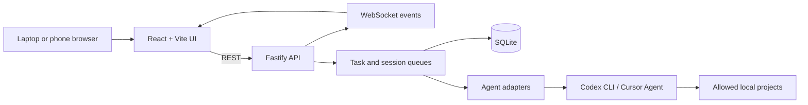

# AgentBridge

AgentBridge is a local-first web control plane for AI coding agents. It lets a
lightweight browser on a laptop or phone create and monitor tasks executed by
agent CLIs on a development workstation. Conversations are persistent, support
Ask, Plan, and Execute modes, and can use Cursor Agent, Codex CLI, or an
optional side-by-side Agent Duel.

The workstation keeps the source code, Git repositories, containers, build
tools, and credentials. The remote device only provides the user interface.

> [!WARNING]
> AgentBridge can invoke coding agents that modify local projects. Keep the
> backend private, configure an access token, and review generated changes.

## Why this project exists

Coding agents usually run where the development environment is installed.
AgentBridge separates the control surface from that environment:

- Run CPU-, memory-, and tool-intensive work on a desktop workstation.
- Submit prompts and inspect progress from another device.
- Use one interface for multiple agent CLIs.
- Preserve conversations and task output between browser sessions.
- Avoid exposing arbitrary shell execution through the frontend.

## Implemented features

- React 19 and Vite responsive interface.
- Node.js and Fastify REST API.
- WebSocket updates for tasks and session messages.
- Codex CLI and Cursor Agent adapters.
- Persistent Ask, Plan, and Execute modes for normal sessions.
- Safe agent switching between Cursor and Codex while a session is idle.
- Optional Agent Duel comparisons with parallel, proposal-only responses and a
  persistent winner for each completed round.
- Native Codex session continuation and contextual replay for Cursor sessions.
- Task and session queues governed by the configured concurrency limit.
- Cancellation through `AbortController`.
- Streaming capture of `stdout` and `stderr`.
- SQLite persistence for tasks, sessions, and messages.
- Project allowlist and path validation.
- Pasted PNG, JPEG, WebP, and GIF attachments with declared MIME-type checks
  and a 10 MB decoded-size limit per image.
- Browser speech recognition when the platform supports it.
- Backend system metrics.
- Connection, project, and agent setup wizards with CLI diagnostics.
- Configurable Codex execution model and default agent.
- Dark, light, and system themes.

## Architecture



The backend serves the production frontend from the same origin. Runtime data
is stored outside the tracked source tree under `data/` by default.

More detail is available in [docs/architecture.md](docs/architecture.md).

## Sessions, modes, and agents

Each conversation is stored as a session associated with one registered
project. A session accepts one message at a time and preserves its messages,
status, selected agent, mode, output, and attachment references in SQLite.

Normal Cursor and Codex sessions support three user-selected modes:

| Mode | Intended use |
| --- | --- |
| `Ask` | Questions, explanations, and investigation without requested edits |
| `Plan` | Analysis and an implementation plan before making changes |
| `Execute` | Explicit authorization to edit the registered project and run development tools |

The mode is persisted and can be changed only while the session is idle.
Existing non-duel sessions can also switch between Cursor and Codex while idle,
provided the destination agent is configured and available. Switching agents
clears stale process and native-session state while retaining the visible
conversation as context.

Codex exposes a native session identifier, so later turns normally resume the
same Codex session. Cursor conversations use a bounded contextual replay of the
stored conversation. A greeting, acknowledgement, or mode change alone does
not authorize an agent to resume unfinished work from an earlier turn.

Agent Duel is disabled by default and can be enabled only after both Cursor and
Codex are configured. It runs the same contextual prompt through both agents
concurrently, records their outputs separately, and lets the user select and
persist a winner for each round. Duel sessions remain locked to Plan mode,
cannot switch agents, and instruct both contestants not to edit files; Codex
also runs in its read-only sandbox for duel rounds.

## Technology

| Area | Technology |
| --- | --- |
| Frontend | React 19, Vite |
| Backend | Node.js, Fastify |
| Real time | WebSocket |
| Persistence | SQLite through `better-sqlite3` |
| Process control | `child_process`, `AbortController` |
| Agent integrations | Codex CLI, Cursor Agent CLI |
| Voice input | Web Speech API |

## Requirements

- Node.js 20 or newer. Fastify 5 does not support Node.js 18. Avoid Node.js
  24.19.0: its `ObjectWrap` cleanup-hook change makes `better-sqlite3` crash
  intermittently with `RemoveEnvironmentCleanupHook ... (env) != nullptr`.
- npm.
- Windows for the currently tested process-management behavior.
- Codex CLI, Cursor Agent CLI, or both installed on the backend machine.

Agent authentication remains the responsibility of each CLI. AgentBridge does
not bundle provider credentials.

## Quick start

Install dependencies:

```powershell
npm install
npm install --prefix web
```

Environment files are not loaded automatically. Export variables in the shell
that starts AgentBridge or use a local environment loader. For example, this
creates a random access token for the current PowerShell session:

```powershell
$env:AGENTBRIDGE_ACCESS_TOKEN = [Convert]::ToHexString(
  [Security.Cryptography.RandomNumberGenerator]::GetBytes(32)
)
```

Build the frontend and start the same-origin application from that same shell:

```powershell
npm run build:web
npm start
```

The backend listens on `http://127.0.0.1:3847` by default. Open that address in
a browser, configure at least one installed agent, and register the project
directories that the agents may access. Runtime configuration is written under
the ignored `data/config/` directory.

The current UI does not expose a first-time token-entry field. If the backend
token is enabled, provision the same token in that browser before using
protected API or WebSocket operations:

```javascript
localStorage.setItem("agentbridge_token", "paste-the-same-token-here");
location.reload();
```

For strictly local use on `127.0.0.1`, the backend can initially run without a
token. For any remote or shared-network use, require either the AgentBridge
token or an authenticated access proxy; do not expose an unprotected backend.

## First-time setup

1. Open the same-origin application or enter the backend URL in the connection
   wizard when using the separate development frontend.
2. Configure Cursor Agent, Codex CLI, or both. The wizard checks CLI discovery,
   version output, authentication, and a minimal test invocation.
3. For Codex, select a model available to the account authenticated by the
   backend CLI.
4. Register one or more project directories. Submitted tasks can target only
   exact paths in this local allowlist.
5. Select a project, agent, and mode, then create a session and send a message.
6. Optionally enable Agent Duel in Settings after both agents are configured.

## Development

Start the backend (watch mode) and the Vite frontend with one command:

```powershell
npm run dev
```

The launcher prefixes each process's output with `[server]` or `[web]` and stops
both when either exits or when you press Ctrl+C. The frontend prefers port
`5173`; if Windows has reserved it (Hyper-V, WSL, and Docker commonly reserve
port ranges, which makes Vite fail with `EACCES`), the next free port is used
and printed at startup. Set `AGENTBRIDGE_WEB_PORT` to force a specific port.
The launcher also adds the chosen frontend origin to
`AGENTBRIDGE_ALLOWED_ORIGINS` and points the frontend at the backend unless
`VITE_AGENTBRIDGE_API_ORIGIN` is already configured.

Use `npm run dev:server` and `npm run dev:web` to run either side separately.
The development origins `http://localhost:5173` and `http://127.0.0.1:5173` are
allowed by default. Add other trusted origins to `AGENTBRIDGE_ALLOWED_ORIGINS`.

Available commands:

| Command | Purpose |
| --- | --- |
| `npm start` | Start the Fastify backend |
| `npm run dev` | Start the backend in watch mode and the Vite development server together |
| `npm run dev:server` | Start only the backend in watch mode |
| `npm run dev:web` | Start only the Vite development server |
| `npm run build:web` | Build the frontend |
| `npm test` | Run process, Cursor adapter, configuration, route, session queue, and Agent Duel tests |
| `npm run audit:public` | Scan tracked files for common publication risks |
| `npm run test:codex` | Run the optional Codex integration check |
| `npm run test:cursor` | Run the optional Cursor integration check |

The two optional integration checks invoke locally installed agent CLIs and are
not part of the default CI workflow. The default test suite uses controlled
test doubles and does not intentionally start a real Codex or Cursor task.

## Configuration

Public examples are stored in:

- `server/config/agents.example.json`
- `server/config/projects.example.json`
- `.env.example`

Actual values are created at runtime under `data/config/` and are ignored by
Git. The access token can be supplied through
`AGENTBRIDGE_ACCESS_TOKEN`, which takes precedence over the JSON configuration.
The runtime agent configuration stores which adapters are configured, the
selected Codex model, whether Agent Duel is enabled, the shared concurrency
limit, and an optional fallback access token. The project configuration stores
the registered project names and absolute paths.

Important environment variables:

| Variable | Default | Description |
| --- | --- | --- |
| `HOST` | `127.0.0.1` | Backend bind address |
| `PORT` | `3847` | Backend port |
| `AGENTBRIDGE_ACCESS_TOKEN` | Empty | Bearer token for HTTP and WebSocket access |
| `AGENTBRIDGE_VAPID_SUBJECT` | `mailto:admin@agentbridge.local` | Contact value used by Web Push |
| `AGENTBRIDGE_VAPID_PUBLIC_KEY` | Generated automatically | Optional stable Web Push public key |
| `AGENTBRIDGE_VAPID_PRIVATE_KEY` | Generated automatically | Optional stable Web Push private key |
| `AGENTBRIDGE_ALLOWED_ORIGINS` | Local Vite origins | Additional comma-separated browser origins |
| `AGENTBRIDGE_DATA_DIR` | Repository `data/` | Private runtime data directory |

Browser-only preferences are stored in that browser's `localStorage`. They
include the backend origin, access token, setup-complete flag, default agent,
theme, sidebar width, and system-metrics visibility. Do not use a shared or
untrusted browser profile with a privileged AgentBridge backend.

## API overview

The UI uses these backend surfaces:

| Surface | Purpose |
| --- | --- |
| `/health`, `/api/health` | Public minimal health response |
| `/api/setup/status`, `/api/connections/test` | CLI, connection, and initial-setup diagnostics |
| `/api/agents/*` | Agent configuration, usage, and Duel settings |
| `/api/projects/*` | Project validation and allowlist management |
| `/api/tasks/*` | Legacy task creation, status, output, cancellation, and deletion |
| `/api/sessions/*` | Persistent conversations, agent/mode changes, cancellation, and Duel winners |
| `/api/sessions/:id/messages/*` | Session messages and explicit replay operations |
| `/api/system-metrics` | Backend CPU, memory, disk, process, and host metrics |
| `/ws` | Live task, session, message, and output events |

There is no frontend endpoint that accepts an arbitrary shell command. Agent
prompts can still cause a configured coding agent to run tools with the
permissions available to the backend operating-system account.

## Runtime data

The following information is deliberately excluded from source control:

- Access tokens and local agent configuration.
- Registered project names and absolute paths.
- SQLite databases and WAL files.
- Prompts, responses, session history, and logs.
- Uploaded screenshots and image attachments.
- Local environment files.

The image attachment service trusts the declared Data URL MIME type after
checking it against a small allowlist; it does not inspect file signatures or
guarantee that the decoded bytes are a valid image.

Do not attach the runtime `data/` directory to issues or releases without
reviewing and redacting it.

## Security model

AgentBridge is designed for local or private-network operation:

1. It binds to localhost by default.
2. The browser can select only registered projects.
3. The frontend submits agent tasks, not arbitrary shell commands.
4. A configured token protects non-health HTTP endpoints and the WebSocket.
5. CORS uses an explicit origin allowlist.
6. Public health responses do not expose hostname or operating-system details.

CORS is a browser policy, not authentication. If no access token is configured,
non-health endpoints accept requests from any client that can reach the bind
address. Keep the default localhost binding unless a protected network path is
ready.

For remote access, first build the frontend and use the same-origin application
on port `3847`. Then place it behind Tailscale, Cloudflare Access, or another
authenticated private-network or access-proxy layer. Add the exact trusted
browser origin to `AGENTBRIDGE_ALLOWED_ORIGINS` when it differs from the backend
origin. Do not forward port `3847` directly from a router or publish an
unauthenticated quick tunnel.

See [SECURITY.md](SECURITY.md) for deployment guidance and vulnerability
reporting.

## Additional documentation

- [Installation and development instructions](1-README-INSTRUCTIONS.md)
- [Application configuration guide](2-APPLICATION-CONFIGURATION.md)
- [Architecture details](docs/architecture.md)
- [Security policy](SECURITY.md)

## Repository layout

```text
.
|-- server/
|   |-- agents/       # CLI adapters and diagnostics
|   |-- realtime/     # WebSocket client registry and broadcasts
|   |-- routes/       # Fastify HTTP routes
|   |-- services/     # Tasks, projects, setup, logs, and attachments
|   |-- sessions/     # Conversation persistence and queueing
|   `-- utils/
|-- web/
|   `-- src/          # React application
|-- scripts/          # Tests, diagnostics, and publication audit
|-- data/             # Ignored runtime state
|-- docs/
`-- .github/workflows/
```

## Project status

AgentBridge is an experimental, Windows-first personal engineering project. It
is useful as a local tool and architecture reference, but it is not a hosted
multi-user service and has not received a third-party security audit.

Potential future work:

- Stronger multi-user authentication and authorization.
- Configurable confirmation policies for high-impact agent actions.
- Broader automated test coverage.
- Cross-platform process-tree cancellation.
- Pluggable agent adapters.
- Optional local speech-to-text.

## License

AgentBridge is available under the [MIT License](LICENSE).
