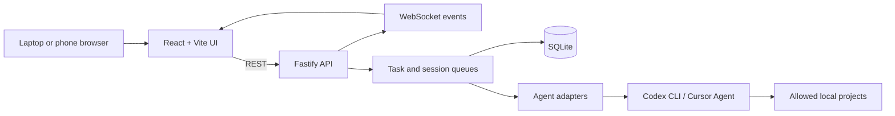

# AgentBridge

AgentBridge is a local-first web control plane for AI coding agents. It lets a
lightweight browser on a laptop or phone create and monitor tasks executed by
agent CLIs on a development workstation.

The workstation keeps the source code, Git repositories, containers, build
tools, and credentials. The remote device only provides the user interface.

> [!WARNING]
> AgentBridge can invoke coding agents that modify local projects. Keep the
> backend private, configure an access token, and review generated changes.

## Why this project exists

Coding agents usually run where the development environment is installed.
AgentBridge separates the control surface from that environment:

- Run CPU-, memory-, and tool-intensive work on a desktop workstation.
- Submit prompts and inspect progress from another device.
- Use one interface for multiple agent CLIs.
- Preserve conversations and task output between browser sessions.
- Avoid exposing arbitrary shell execution through the frontend.

## Implemented features

- React 19 and Vite responsive interface.
- Node.js and Fastify REST API.
- WebSocket updates for tasks and session messages.
- Codex CLI and Cursor Agent adapters.
- Native Codex session continuation.
- Task queue with configurable concurrency.
- Cancellation through `AbortController`.
- Streaming capture of `stdout` and `stderr`.
- SQLite persistence for tasks, sessions, and messages.
- Project allowlist and path validation.
- Image attachments with type and size validation.
- Browser speech recognition when the platform supports it.
- Backend system metrics.
- Setup diagnostics for supported agent CLIs.
- Dark, light, and system themes.

## Architecture



The backend serves the production frontend from the same origin. Runtime data
is stored outside the tracked source tree under `data/` by default.

More detail is available in [docs/architecture.md](docs/architecture.md).

## Technology

| Area | Technology |
| --- | --- |
| Frontend | React 19, Vite |
| Backend | Node.js, Fastify |
| Real time | WebSocket |
| Persistence | SQLite through `better-sqlite3` |
| Process control | `child_process`, `AbortController` |
| Agent integrations | Codex CLI, Cursor Agent CLI |
| Voice input | Web Speech API |

## Requirements

- Node.js 18 or newer.
- npm.
- Windows for the currently tested process-management behavior.
- Codex CLI, Cursor Agent CLI, or both installed on the backend machine.

Agent authentication remains the responsibility of each CLI. AgentBridge does
not bundle provider credentials.

## Quick start

Install dependencies:

```powershell
npm install
npm install --prefix web
```

Create a local environment file and set a long random access token:

```powershell
Copy-Item .env.example .env
```

Environment files are not loaded automatically. Export the variables in the
shell or use your preferred local environment loader before starting.

Build the frontend and start the same-origin application:

```powershell
npm run build:web
npm start
```

The backend listens on `http://127.0.0.1:3847` by default. Projects are added
through the setup interface and written to ignored runtime configuration.

## Development

Run the backend and frontend in separate terminals:

```powershell
npm run dev
```

```powershell
npm run dev:web
```

The development origins `http://localhost:5173` and
`http://127.0.0.1:5173` are allowed by default. Add other trusted origins to
`AGENTBRIDGE_ALLOWED_ORIGINS`.

Available commands:

| Command | Purpose |
| --- | --- |
| `npm start` | Start the Fastify backend |
| `npm run dev` | Start the backend in watch mode |
| `npm run dev:web` | Start the Vite development server |
| `npm run build:web` | Build the frontend |
| `npm test` | Run process and configuration tests |
| `npm run audit:public` | Scan tracked files for common publication risks |
| `npm run test:codex` | Run the optional Codex integration check |
| `npm run test:cursor` | Run the optional Cursor integration check |

The two integration checks invoke locally installed agent CLIs and are not part
of the default CI workflow.

## Configuration

Public examples are stored in:

- `server/config/agents.example.json`
- `server/config/projects.example.json`
- `.env.example`

Actual values are created at runtime under `data/config/` and are ignored by
Git. The access token can be supplied through
`AGENTBRIDGE_ACCESS_TOKEN`, which takes precedence over the JSON configuration.

Important environment variables:

| Variable | Default | Description |
| --- | --- | --- |
| `HOST` | `127.0.0.1` | Backend bind address |
| `PORT` | `3847` | Backend port |
| `AGENTBRIDGE_ACCESS_TOKEN` | Empty | Bearer token for HTTP and WebSocket access |
| `AGENTBRIDGE_ALLOWED_ORIGINS` | Local Vite origins | Additional comma-separated browser origins |
| `AGENTBRIDGE_DATA_DIR` | Repository `data/` | Private runtime data directory |

## Runtime data

The following information is deliberately excluded from source control:

- Access tokens and local agent configuration.
- Registered project names and absolute paths.
- SQLite databases and WAL files.
- Prompts, responses, session history, and logs.
- Uploaded screenshots and image attachments.
- Local environment files.

Do not attach the runtime `data/` directory to issues or releases without
reviewing and redacting it.

## Security model

AgentBridge is designed for local or private-network operation:

1. It binds to localhost by default.
2. The browser can select only registered projects.
3. The frontend submits agent tasks, not arbitrary shell commands.
4. A configured token protects HTTP endpoints and the WebSocket.
5. CORS uses an explicit origin allowlist.
6. Public health responses do not expose hostname or operating-system details.

For remote access, use Tailscale, Cloudflare Access, or another authenticated
private network. Do not forward the backend port directly from a router.

See [SECURITY.md](SECURITY.md) for deployment guidance and vulnerability
reporting.

## Repository layout

```text
.
|-- server/
|   |-- agents/       # CLI adapters and diagnostics
|   |-- realtime/     # WebSocket client registry and broadcasts
|   |-- routes/       # Fastify HTTP routes
|   |-- services/     # Tasks, projects, setup, logs, and attachments
|   |-- sessions/     # Conversation persistence and queueing
|   `-- utils/
|-- web/
|   `-- src/          # React application
|-- scripts/          # Tests, diagnostics, and publication audit
|-- data/             # Ignored runtime state
|-- docs/
`-- .github/workflows/
```

## Project status

AgentBridge is an experimental, Windows-first personal engineering project. It
is useful as a local tool and architecture reference, but it is not a hosted
multi-user service and has not received a third-party security audit.

Potential future work:

- Stronger multi-user authentication and authorization.
- Configurable confirmation policies for high-impact agent actions.
- Broader automated test coverage.
- Cross-platform process-tree cancellation.
- Pluggable agent adapters.
- Optional local speech-to-text.

## License

AgentBridge is available under the [MIT License](LICENSE).
